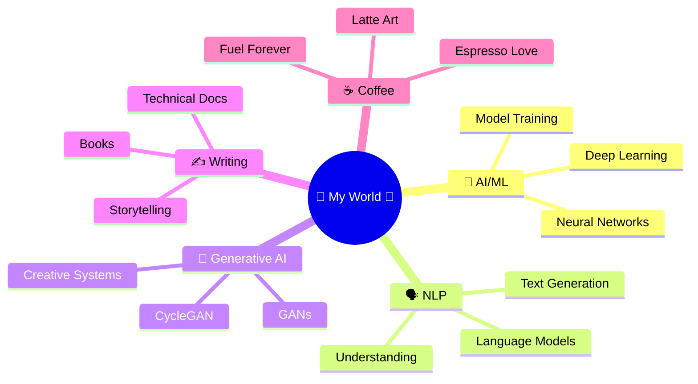

<!-- ========================================================= -->
<!-- ✨ COFFEE × CODE × AI — MAGICAL PROFILE README ✨          -->
<!-- ========================================================= -->

<div align="center">

<!-- Animated Header -->


<!-- Typing Animation with More Flair -->


<br/>

<!-- Sparkle Divider -->


<!-- Profile Views with Cute Style -->


</div>

<br/>

<!-- Coffee Rain Animation -->
<div align="center">

</div>

---

## ☕ About Me — Brewing Intelligence with Love 💕

```javascript
class GirlyCoder {
  constructor() {
    this.name = "Ruparani";
    this.passion = ["AI", "ML", "Writing", "Coffee"];
    this.vibe = "✨ Sparkles & Code ✨";
  }
  
  dailyRoutine() {
    while(coffee.isHot() && dreams.areBig()) {
      this.sipCoffee();      // ☕ Essential fuel
      this.thinkDeep();      // 🧠 Research mode
      this.trainModels();    // 🤖 AI magic
      this.writeCode();      // 💻 Build dreams
      this.writeWords();     // ✍️ Share knowledge
      this.addSparkle();     // ✨ Because why not?
    }
  }
  
  getQuote() {
    return "Dream big, code bigger! 💖";
  }
}

const me = new GirlyCoder();
me.dailyRoutine();
```

<div align="center">

I am **Ruparani** (@Ruparani777) — an **AI/ML Engineer** who builds intelligent systems powered by **machine learning**, **deep learning**, and **generative AI**. I work where **research depth** meets **creative sparkle** meets **engineering excellence**! 💕


</div>

---

## 🌸 What Makes Me Sparkle ✨

<div align="center">

<table>
<tr>
<td align="center" width="25%">
<br/>
<b>🎀 Coffee Addict</b><br/>
<sub>Fuel for everything</sub>
</td>
<td align="center" width="25%">
<br/>
<b>💻 AI Engineer</b><br/>
<sub>Building the future</sub>
</td>
<td align="center" width="25%">
<br/>
<b>✍️ Author</b><br/>
<sub>2 published books</sub>
</td>
<td align="center" width="25%">
<br/>
<b>🌟 Dreamer</b><br/>
<sub>Research × Startup</sub>
</td>
</tr>
</table>

</div>

---

## 🧠 Knowledge Garden 🌸

<div align="center">




</div>

---

## 💻 My Tech Toolbox 🎀

<div align="center">

### Languages & Frameworks 💕


### AI/ML Magic ✨


### Tools & More 🛠️


</div>

---

## 🔬 Research Playground 🌈

<div align="center">

<table>
<tr>
<td width="50%">

#### 🎨 Current Experiments
- 🤖 Generative Adversarial Networks
- 🔄 CycleGAN & Style Transfer
- 🗣️ NLP & Language Models
- 🧬 Neural Architecture Search
- ⚡ Model Optimization & Efficiency

</td>
<td width="50%">

#### 💡 Curiosity Corner
- 📚 Reading latest AI papers
- 🧪 Prototyping wild ideas
- 🌟 Open-source contributions
- 🚀 Startup experiments
- ☕ Coffee tasting (important!)

</td>
</tr>
</table>


</div>

---

## 📚 Author Mode — Words That Matter 💕

<div align="center">


### ✨ Published Works ✨

I am the proud author of **two books published on Amazon KDP**! 📖✨

Writing helps me translate complex AI systems into meaningful stories and clear understanding.

> *"Code teaches machines. Writing teaches humans. Coffee teaches patience."* ☕💖

</div>

---

## 🎀 Coffee-Powered Stats & Sparkles ✨

<div align="center">


<br/>


<br/>


</div>

---

## 🌟 Currently Brewing ☕

<div align="center">

<table>
<tr>
<td align="center" width="33%">
<br/>
<b>🎨 Generative AI Projects</b><br/>
<sub>Creating magic with GANs</sub>
</td>
<td align="center" width="33%">
<br/>
<b>🧪 Research Experiments</b><br/>
<sub>Pushing boundaries</sub>
</td>
<td align="center" width="33%">
<br/>
<b>💖 Open Source Love</b><br/>
<sub>Contributing to community</sub>
</td>
</tr>
</table>

</div>

---

## 🤝 Let's Connect Over Coffee ☕💕

<div align="center">

I'm always excited to collaborate on:

✨ **Research Projects** • 🤖 **AI/ML Innovations** • 🎨 **Generative AI** • 🗣️ **NLP Systems**
💡 **Startup Ideas** • 📚 **Writing Projects** • 🌈 **Creative Tech** • ☕ **Coffee Chats**

<br/>

<!-- Social Buttons -->
<a href="https://github.com/Ruparani777">
  
</a>
<a href="https://linkedin.com/in/yourprofile">
  
</a>
<a href="mailto:your.email@example.com">
  
</a>
<a href="https://twitter.com/yourhandle">
  
</a>

<br/><br/>


### 💖 My Motto 💖

**✨ Research-driven mind. Startup-ready hands. Coffee-powered heart. ✨**

*Dream big. Code bigger. Sparkle always.* 🌟

</div>

---

<div align="center">


### ✨ Fun Facts About Me ✨

💕 **Favorite Drink:** Lavender Latte with extra foam ☕
🎀 **Coding Playlist:** Lo-fi beats + Rain sounds 🌧️
🌸 **Dream:** Build AI that makes the world sparkle ✨
💖 **Superpower:** Debugging with coffee & determination 🔧
🌈 **Philosophy:** Make it work. Make it beautiful. Make it matter.

<br/>


<sub>✨ *This README is handcrafted with coffee, code, and a whole lot of sparkle* ✨</sub>

<br/>

<!-- Footer Wave -->


</div>

<!-- Easter Egg: Hidden Message -->
<!-- 
    ☕ If you read this far, you're amazing! 
    Let's grab virtual coffee sometime! 
    - Ruparani 💕
-->
