# ✨ Ruparani Thupakula

<div align="center">

<!-- Animated Typing Header -->


<br/>

<!-- Cosmic Wave Divider -->


<br/>

<!-- Profile Views & Social Badges -->


[](https://linkedin.com/in/yourprofile)
[](https://amazon.com/author/ruparani)
[](mailto:your.email@example.com)
[](https://yourportfolio.com)

</div>

<br/>

<div align="center">

</div>

---

## 🌸 The Cosmic Engineer

<div align="center">

### *"In the space between algorithms and awareness, I build universes"*

</div>

```python
class RuparaniThupakula:
    def __init__(self):
        self.identity = {
            "role": "AI/ML Engineer 🤖",
            "soul": "Author & Philosopher 📚",
            "location": "🌏 Chennai, India",
            "status": "Forever Learning ♾️"
        }
        
        self.fuel = ["☕ Espresso", "📖 Books", "🌌 Stargazing", "🎨 Creativity"]
        
        self.tech_universe = {
            "languages": ["Python", "C", "C++", "JavaScript"],
            "ml_frameworks": ["PyTorch", "TensorFlow", "Keras", "Hugging Face"],
            "specializations": ["GANs", "CycleGAN", "NLP", "Deep Learning"],
            "philosophy": "Build with intention, code with consciousness"
        }
        
        self.creative_side = {
            "published_books": 2,
            "genres": ["Mindfulness", "Love", "Philosophy"],
            "next_project": "AI meets Ancient Wisdom"
        }
    
    def manifesto(self):
        return """
        I believe in AI that doesn't just compute, but contemplates.
        Code that doesn't just execute, but expresses.
        Models that don't just predict, but understand.
        
        Like the universe itself—
        Creating, learning, evolving, forever.
        """
    
    def daily_ritual(self):
        while self.coffee.isHot():
            self.train_neural_networks()
            self.read_research_papers()
            self.write_stories()
            self.contemplate_existence()
            self.contribute_to_humanity()

me = RuparaniThupakula()
print(me.manifesto())
```

<div align="center">
<br/>

</div>

<br/>

I'm **Ruparani Thupakula** — an AI/ML Engineer who writes code during the day and poetry at night. I build intelligent systems that live at the crossroads of **machine learning**, **deep learning**, and **generative AI**, while drawing inspiration from the cosmos, human psychology, and timeless literature.

<div align="center">

### 🌟 My Constellation

**🧠 Technical Soul** • **📚 Literary Heart** • **🌌 Cosmic Mind** • **☕ Caffeinated Spirit**

</div>

---

## 💫 The Multiverse I Inhabit

```mermaid
mindmap
  root((✨ Ruparani))
    🤖 AI & Machine Learning
      Deep Learning Magic
      NLP Wizardry
      Generative AI Dreams
      GANs & CycleGAN Art
      Computer Vision
      Research & Innovation
    📖 Author & Storyteller
      Published Works
      Creative Writing
      Narrative Craft
      Poetry in Prose
    🧘‍♀️ Philosophy & Consciousness
      Cosmology & Universe
      Psychology of Being
      Law of Attraction
      Mindful Technology
      Ancient Wisdom
    🌸 Human Connection
      Open Source Love
      Community Building
      Mentorship
      Knowledge Sharing
```

<div align="center">





</div>

---

## 🎨 My Published Universe

<div align="center">


### ✍️ Words That Live Beyond Code

<br/>

<table>
<tr>
<td width="50%" align="center">
<br/>
<h2>📖 The Epitome of Slow Living</h2>
<br/>
<p><i>"In a world racing forward, I chose to stand still and truly see"</i></p>
<br/>
<p align="left">
A meditative journey through the art of mindfulness and authenticity. This book is an invitation to pause, breathe, and discover the profound beauty hidden in life's simplest moments. It's not about doing less—it's about being more.
</p>
<br/>
<a href="https://amazon.com/author/ruparani">

</a>
<br/><br/>
</td>
<td width="50%" align="center">
<br/>
<h2>💝 Echoes of Her Intact Heart</h2>
<br/>
<p><i>"A daughter's love letter to her mother's unbreakable spirit"</i></p>
<br/>
<p align="left">
A deeply personal tribute celebrating the unconditional love, boundless strength, and timeless bonds between mother and daughter. Through moments of joy, sorrow, and profound connection, this book honors the heart that never breaks—only transforms.
</p>
<br/>
<a href="https://amazon.com/author/ruparani">

</a>
<br/><br/>
</td>
</tr>
</table>

<br/>

> **"Code teaches machines to think. Writing teaches humans to feel. Together, they weave the fabric of consciousness."**


</div>

---

## 💻 Technical Arsenal — Tools of Creation

<div align="center">


### Languages That Shape Realities


### AI/ML Frameworks — The Magic Wands


### Data Science Toolkit


### Developer Ecosystem


</div>

---

## 🔬 Research Domains — Where I Push Boundaries

<div align="center">


| 🎯 Domain | 🌟 Focus | 💫 Current Exploration |
|-----------|----------|------------------------|
| **🎨 Generative AI** | GANs, CycleGAN, Diffusion Models, VAEs | Exploring unpaired image-to-image translation |
| **🗣️ Natural Language Processing** | Transformers, LLMs, Sentiment Analysis | Fine-tuning language models for creative writing |
| **🧠 Deep Learning** | CNNs, RNNs, Neural Architecture Design | Experimenting with custom architectures |
| **👁️ Computer Vision** | Image Segmentation, Object Detection | Real-time visual processing systems |
| **🔮 Experimental AI** | Novel Training Techniques, Research | Pushing the boundaries of what's possible |


</div>

<div align="center">
<br/>

</div>

---

## 🎨 My Unique Approach — The Four Pillars

<div align="center">


<table>
<tr>
<td align="center" width="25%">
<br/>
<h3>🧠 Conscious Computing</h3>
<br/>
<p>Every neural network trained with intention. Every parameter tuned with purpose. AI that serves consciousness, not just computation.</p>
<br/>
</td>
<td align="center" width="25%">
<br/>
<h3>📖 Narrative-Driven Development</h3>
<br/>
<p>Code that reads like literature. Documentation that tells stories. Comments that inspire thought. Programming as creative expression.</p>
<br/>
</td>
<td align="center" width="25%">
<br/>
<h3>🌸 Ethical Innovation</h3>
<br/>
<p>Technology that respects humanity. AI that enhances rather than replaces. Innovation rooted in compassion and understanding.</p>
<br/>
</td>
<td align="center" width="25%">
<br/>
<h3>✨ Cosmic Perspective</h3>
<br/>
<p>Bringing universal wisdom into technical decisions. Seeing the bigger picture. Understanding that every line of code ripples through reality.</p>
<br/>
</td>
</tr>
</table>

<br/>

```python
philosophy = {
    "quality": "always_over_quantity",
    "depth": "always_over_breadth", 
    "learning": float('infinity'),
    "giving_back": "non_negotiable",
    "human_first": True,
    "consciousness": "in_every_algorithm",
    "beauty": "in_every_gradient"
}
```


</div>

---

## 💭 Questions I Ask While Training Models

<div align="center">


<br/>


<br/><br/>

</div>

- 🤔 **Can machines truly create?** Or do they merely recombine what we feed them? Exploring the boundary between computation and creativity.

- 🌌 **What is consciousness?** Can we measure awareness in activation patterns? Is intelligence the same as understanding?

- 💝 **How do we teach empathy to algorithms?** Can a neural network learn to care? Should it?

- ☕ **Why does coffee unlock creativity?** Is there a scientific basis, or is it pure magic? (Probably magic.)

- 🎨 **Where does mathematics become art?** At what point does a gradient descent turn into a masterpiece?

- 🧘‍♀️ **Can we apply mindfulness to machine learning?** What if we trained models slowly, with intention, like meditation?

- 📚 **If AI learns from human text, does it absorb our collective wisdom or our collective biases?** How do we teach it to be better than us?

- 🌸 **What would it mean to build "slow AI"?** Technology that prioritizes depth over speed, understanding over efficiency.

<div align="center">

</div>

---

## 🚀 Currently Brewing in My Lab

<div align="center">


<br/>


<br/>

</div>

🎨 **Generative Art with GANs** — Creating visual poetry through adversarial networks

🔮 **CycleGAN Experiments** — Unpaired image translation for creative applications

🗣️ **NLP for Creative Writing** — Fine-tuning language models to write like philosophers

🧠 **Custom Neural Architectures** — Designing networks that think differently

🌐 **Open Source Contributions** — Building tools that empower the community

📖 **Third Book** — *"The Algorithm of Awareness: Where AI Meets Ancient Wisdom"* (Coming Soon)

🌌 **AI × Philosophy Blog** — Weekly essays on consciousness and computation

---

## 📊 GitHub Cosmos — Analytics & Insights

<div align="center">


<br/>


<br/>


</div>

---

## 🎯 Skills & Expertise Constellation

```mermaid
graph LR
    A[🤖 Machine Learning] --> B[🧠 Deep Learning]
    B --> C[Neural Networks]
    C --> D[🎨 GANs]
    C --> E[📷 CNNs]
    C --> F[⏰ RNNs/LSTMs]
    
    A --> G[🗣️ NLP]
    G --> H[Transformers]
    H --> I[BERT]
    H --> J[GPT]
    G --> K[Text Generation]
    
    A --> L[👁️ Computer Vision]
    L --> M[Image Processing]
    L --> N[Object Detection]
    L --> O[Segmentation]
    
    A --> P[🔬 Research]
    P --> Q[Paper Implementation]
    P --> R[Experimentation]
    P --> S[Innovation]
    
    style A fill:#FF69B4,stroke:#FF1493,stroke-width:3px
    style B fill:#FFB6C1,stroke:#FF69B4,stroke-width:2px
    style G fill:#FFC0CB,stroke:#FFB6C1,stroke-width:2px
    style L fill:#FF69B4,stroke:#FF1493,stroke-width:2px
    style P fill:#FFB6C1,stroke:#FF69B4,stroke-width:2px
    style D fill:#FF1493,stroke:#C71585,stroke-width:2px
```

<div align="center">



</div>

---

## 🤝 Let's Create Magic Together

<div align="center">


<br/>

### I'm Always Open To

🔬 **Research Collaborations** — Let's push the boundaries of AI together

🤖 **Generative AI Projects** — Creating systems that surprise and inspire

📖 **Tech × Literature Conversations** — Bridging two worlds through words

🌟 **Open Source Initiatives** — Building tools that empower communities

☕ **Coffee & Deep Conversations** — Philosophy, AI, consciousness, existence

🎨 **Creative AI Applications** — Using ML for art, music, and expression

💝 **Mentorship** — Guiding aspiring engineers on their journey

<br/>

### 📬 Connect With Me

[](https://linkedin.com/in/yourprofile)
[](mailto:your.email@example.com)
[](https://twitter.com/yourhandle)
[](https://yourportfolio.com)

<br/>

**✨ Let's build technology that serves humanity — where intelligence meets intention ✨**

</div>

---

## 💝 Support This Cosmic Journey

<div align="center">

If my work resonates with you, consider supporting through:

[](https://buymeacoffee.com/ruparani)
[](https://ko-fi.com/ruparani)

<sub>Your support helps fuel more coffee, more code, more consciousness, and more cosmic explorations! ☕✨</sub>

</div>

---

## 🏆 Recognition & Achievements

<div align="center">


</div>

---

## 📈 Contribution Journey

<div align="center">


</div>

---

## 💬 A Quote That Guides Me

<div align="center">


</div>

---

<div align="center">


<br/><br/>

### 🌸 *Crafted with coffee, consciousness, and cosmic love* 🌸

**"In the garden of intelligence, every model is a flower, every line of code is a seed, and every bug is a teacher. This is not just engineering—this is alchemy."**

<br/>

<sub>⭐ If this resonates with your soul, star this cosmic space ⭐</sub>

<br/><br/>


</div>

---

<div align="center">


<br/>

**Last Updated:** December 2024 | **Built with** 💖 **and** ☕ **by a dreamer who codes**

<br/>

*"Between the zeros and ones, I found infinity"*

</div>
